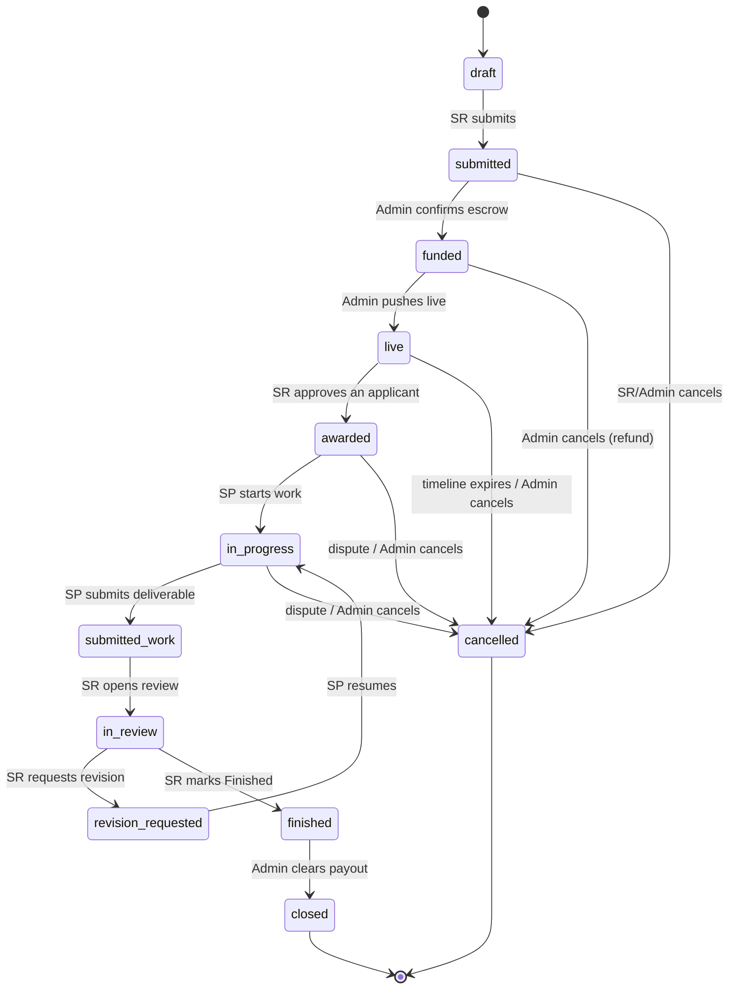
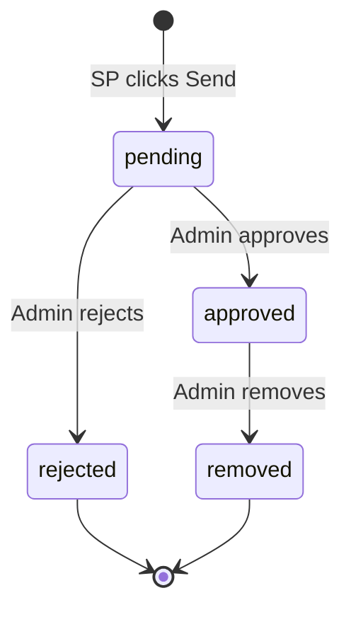

# Zirclaire — State Machines

Reference for the two moderated lifecycles: **projects** (with escrow) and **social posts**. Every state below maps directly to a `status` enum value in `db/schema.sql`, and every transition maps to an RLS-guarded action. If it's not in this table, it's not a legal transition.

---

## 1. Project Lifecycle

### 1.1 States

| Status | Meaning | Who's waiting |
|---|---|---|
| `draft` | SR is still editing; not submitted | SR |
| `submitted` | Sent to Admin; awaiting funding confirmation | Admin / SR to fund |
| `funded` | Escrow secured; awaiting go-live push | Admin |
| `live` | Public on SP feed; accepting applications | SPs |
| `awarded` | SR picked an SP; work not yet started | SP |
| `in_progress` | SP is working | SP |
| `submitted_work` | SP submitted a deliverable | SR |
| `in_review` | SR is reviewing the deliverable | SR |
| `revision_requested` | SR asked for changes | SP (loops back) |
| `finished` | SR accepted; awaiting Admin clearance | Admin |
| `closed` | Payout + commission settled; terminal | — |
| `cancelled` | Terminated before completion (refund path) | — |

### 1.2 Diagram

### 1.3 Transition table (authoritative)

| # | From | To | Trigger (actor) | Guard / precondition | DB side effects |
|---|---|---|---|---|---|
| 1 | `draft` | `submitted` | SR | Own project; required fields present | — |
| 2 | `submitted` | `funded` | Admin | Funds confirmed | `escrow_ledger` += `fund` (+amount) |
| 3 | `funded` | `live` | Admin | — | Set `went_live_at`, start timeline |
| 4 | `live` | `awarded` | SR | Own project; applicant exists | Set `awarded_provider_id`, `awarded_application_id` |
| 5 | `awarded` | `in_progress` | SP | Is the awarded SP | Set `started_at` |
| 6 | `in_progress` | `submitted_work` | SP | Is the awarded SP; deliverable row exists | Insert `deliverables` row |
| 7 | `submitted_work` | `in_review` | SR | Own project | — |
| 8 | `in_review` | `revision_requested` | SR | Own project | Insert `reviews` row (revision, reason) |
| 9 | `revision_requested` | `in_progress` | SP | Is the awarded SP | — |
| 10 | `in_review` | `finished` | SR | Own project | Insert `reviews` row (accepted); set `finished_at` |
| 11 | `finished` | `closed` | Admin | — | `escrow_ledger` += `commission` (−20%), `payout` (−80%); set `closed_at` |
| 12 | any active* | `cancelled` | Admin (or SR pre-award) | Per policy | `escrow_ledger` += `refund` if funded; set `cancelled_at`, reason |

\* active = `submitted`, `funded`, `live`, `awarded`, `in_progress`.

### 1.4 Escrow ledger events

`escrow_ledger` is **append-only**. A project's held balance = sum of its entries.

| Entry type | Sign | When |
|---|---|---|
| `fund` | + | SR funds (transition 2) |
| `commission` | − | Admin clears (transition 11), = 20% of funded |
| `payout` | − | Admin clears (transition 11), = 80% of funded |
| `refund` | − | Cancellation of a funded project (transition 12) |

Invariant after `closed`: `sum(entries) == 0` for that project (fund fully distributed).
Invariant after `cancelled` (was funded): `fund + refund == 0`.

---

## 2. Social Post Lifecycle

### 2.1 States

| Status | Meaning |
|---|---|
| `pending` | Authored by SP, routed to Admin |
| `approved` | Live on the public feed |
| `rejected` | Blocked by Admin (with reason); not public |
| `removed` | Previously approved, later taken down by Admin |

### 2.2 Diagram

### 2.3 Transition table

| From | To | Actor | DB side effects |
|---|---|---|---|
| — | `pending` | SP | Insert `posts` (≤3 media) |
| `pending` | `approved` | Admin | Set `approved_at`; becomes feed-visible |
| `pending` | `rejected` | Admin | Set `rejected_reason` |
| `approved` | `removed` | Admin | Set `removed_at`, reason; leaves feed |

**Engagement** (favorites, comments, shares) is only permitted on `approved` posts. Comments — by SR or SP — attach to an approved post; media allowed in comments.

---

## 3. Enforcement note

These transitions are enforced by:
1. A Postgres `CHECK`/trigger validating that a new `status` is reachable from the old one.
2. RLS policies restricting *who* may perform the `UPDATE` (see `db/rls_policies.sql`).
3. Ledger inserts happening inside the same transaction as the status change (via SECURITY DEFINER functions), so money and state never drift apart.
